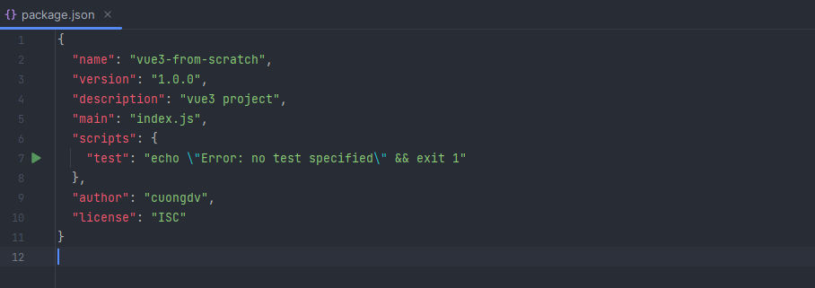
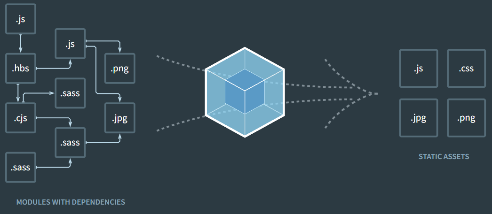
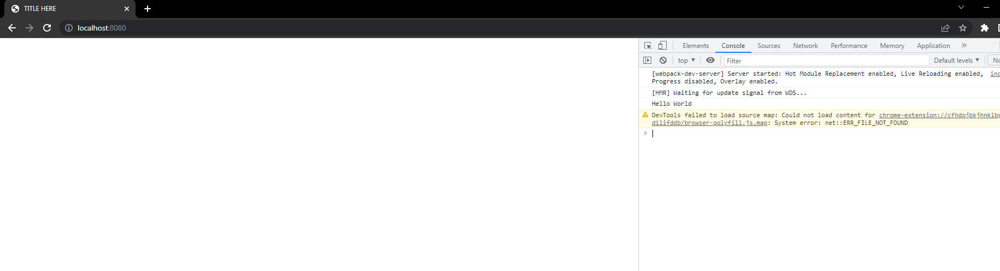
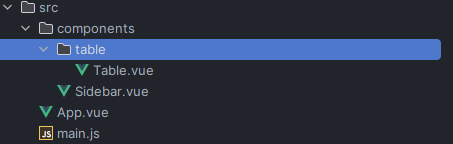
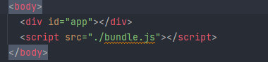
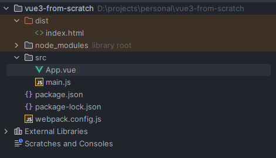
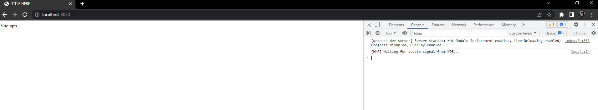

# Tạo project Vue 3 với Webpack

## Lời mở đầu
[Vue.js](https://vuejs.org/guide/introduction.html) là một framework Javascript được tạo ra bởi Evan You, giúp xây dựng giao diện người dùng.

Vue có hai phiên bản, Vue 2 (ra mắt năm 2016) và Vue 3 (2020 ra mắt beta, 2022 ra mắt [chính thức](https://blog.vuejs.org/posts/vue-3-as-the-new-default.html)). Ngoài ra, Vue được sử dụng để tạo giao diện người dùng với nhiều [mục đích](https://vuejs.org/guide/extras/ways-of-using-vue.html#), tuỳ vào một số nhu cầu của người sử dụng nó.

Trong phạm vi bài viết, chúng ta tập trung vào việc tạo một project Vue cho phát triển ứng dụng web. Phiên bản Vue được lựa chọn sẽ là phiên bản mới nhất - Vue 3.

Vậy, chúng ta có cách nào để tạo một project Vue? Dưới đây là lựa chọn trên trang chủ của Vue:

- [Vue.js](https://vuejs.org/guide/quick-start.html)

````js
npm init vue@latest
````

<p align="center">
  
</p>

Thật dễ dàng phải không nào ? Chỉ với một dòng lệnh, npm sẽ thực thi [create-vue](https://github.com/vuejs/create-vue), giúp chúng ta khởi tạo project Vue rất thuận tiện.
Một số câu hỏi cấu hình cho project sẽ do bạn chọn hoặc được tự động thực hiện, giúp giảm thời gian khởi tạo và cấu hình project.

<p align="center">
  <q><i>Life is not that easy</i></q> 😳
</p>


Tuy nhiên, nếu project của chúng ta mở rộng hơn trong tương lai? Sẽ có các vấn đề xảy đến, ví dụ bạn cần cấu hình cho project có nhiều hơn một entry point, hoặc cố gắng cải thiện hiệu suất,...


Trong trường hợp trên, tốt hơn hết là chúng ta nên tạo project Vue từ đầu, cùng với công cụ là webpack. Bạn có thể đọc chi tiết về công cụ này tại đây:

- [Webpack](https://webpack.js.org/)

## Tạo thư mục chứa project

Trước hết, chúng ta cần khởi tạo project và chuẩn bị cho việc cài đặt Vue cũng như các công cụ hỗ trợ.

Tạo mới thư mục tên 'vue3-from-scratch', hoặc bất cứ cái tên nào mà bạn thích. Mở CMD và gõ dòng lệch bên dưới, đảm bảo rằng bạn đã cài đặt [Node.js](https://nodejs.org/en/download/) nhé:

````js
npm init
````

Các tuỳ chọn sẽ hiển thị tương tự như trong ảnh sau, bạn có thể lựa chọn không điền nếu muốn để mặc định:


Tập tin `package.json` được tạo mới với thông tin như ảnh sau:




## Cài đặt webpack

Trong phần này, chúng ta sẽ bắt đầu cài đặt webpack. Webpack được mô tả trong [tài liệu](https://webpack.js.org/concepts/) là một 'static module bundler'.

:::info
Một cách dễ hiểu, trong quá trình code, bạn sẽ cần khai báo, sử dụng image, font, các module hoặc thư viện đã cài tại rất nhiều file khác nhau của project.
Webpack coi chúng là 'dependency' (phụ thuộc).
Từ những 'dependency' này, Webpack sẽ tạo nên một 'dependency graph', tạm hiểu như một mô hình liên kết, bao gồm toàn bộ các module mà project cần, đóng gói chúng lại thành một hoặc một số file.



:::

Webpack cung cấp các gói cài đặt cần thiết, bao gồm `webpack dev server` và `webpack-cli`.

- `webpack dev server`: dev server hỗ trợ hot loading
- `webpack-cli`: công cụ cung cấp các dòng lệnh của webpack

Chạy câu lệnh dưới đây trên cmd để cài đặt hai gói trên:

````js
npm install webpack webpack-cli webpack-dev-server
````

Tiếp theo chúng ta sẽ tạo file cấu hình webpack cho project, đó là `webpack.config.js`

````js
// webpack.config.js
const path = require('path')
module.exports = {
  mode: 'development',
  entry: './src/main.js',
  output: {
    path: path.resolve(__dirname, './dist'),
    filename: 'bundle.js'
  },
  devServer: {
    static: {       
      directory: path.resolve(__dirname, './dist')
    }
  }
}
````

Chúng ta sẽ chú ý tới ba mục chính: entry, output và devServer.
Khi chúng ta khởi chạy project, Webpack đọc file `./src/main.js` và sinh ra file `bundle.js` trong thư mục `./dist`.
Đồng thời, cấu hình của devServer được dùng khi chúng ta chạy project trên dev server.

Về cơ bản thì chúng ta đã sẵn sàng để thực hiện 'bundle' (đóng gói) các file js. Tiếp tục khởi tạo thư mục `src` và file `./src/main.js`.

```js
// ./src/main.js
console.log('Hello World');
```

Để khởi chạy project, chúng ta sẽ bổ sung thêm một số đoạn lệnh cho file `package.json`

````json
{
  "scripts": {
    "dev": "webpack serve",
    "build": "webpack --mode production --progress --hide-modules"
  }
}
````
Cuối cùng, tạo file HTML đơn giản trong thư mục `/dist` với thẻ `script` gắn với file `bundle.js`.

````html
<!DOCTYPE html>
<html lang="en">
  <head>
    <meta charset="utf-8">
    <meta name="viewport" content="width=device-width,initial-scale=1.0">
    <title>TITLE HERE</title>
  </head>
  <body>
    <script src="./bundle.js"></script>
  </body>
</html>
````

Chạy câu lệnh `npm run dev` trên cmd. Mở trình duyệt của bạn và truy cập vào [http://localhost:8080/](http://localhost:8080/)



## Cài đặt Vue

Mở cmd, chạy câu lệnh sau để cài đặt Vue. Chúng ta sẽ chọn phiên bản Vue mới nhất hiện tại là Vue 3

````js
npm install --save vue@next
````

:::tip
Một số tài liệu hướng dẫn yêu cầu bạn cài thêm gói cài đặt `vue/compiler-sfc`. Tuy nhiên, với Vue 3, cụ thể là từ phiên bản `3.2.13+`, `vue/compiler-sfc` được tích hợp trong gói cài đặt `vue`. Vì vậy chúng ta không cần cài đặt riêng gói này nữa.
:::

Đến đây, chúng ta cần cài đặt thêm `vue-loader`:

````js
npm install -D vue-loader
````

`vue-loader` là một loader cho webpack, cho phép chúng ta tạo các file `.vue` dưới định dạng [Single-File Component](https://vue-loader.vuejs.org/spec.html), như ví dụ dưới đây:

````js
<template>
  <div class="example">Hello World</div>
</template>

<script>
export default {
  data () {}
}
</script>

<style>
.example {
  color: green;
}
</style>
````

Nếu bạn muốn tìm hiểu chi tiết hơn về `vue-loader`, bạn có thể truy cập tại [đây](https://vue-loader.vuejs.org/).

Tiếp đến, chúng ta cần bổ sung thêm cấu hình cho file `webpack.config.js`:

````js
module: {
  rules: [
    // ... other rules
    {
      test: /\.vue$/,
      loader: 'vue-loader'
    }
  ]
},
plugins: [
  // make sure to include the plugin!
  new VueLoaderPlugin()
]
````
Chúng ta sẽ cập nhật lại file `./src/main.js` với nội dung như bên dưới:

````js
import { createApp } from 'vue';

import App from './App.vue'

createApp(App).mount('#app')
````

:::info
Bất cứ một project Vue nào khi được build sẽ đều tạo một `instance` mới với phương thức `createApp` do `vue` cung cấp.

Object chúng ta truyền vào phương thức `createApp` thực chất là một `component`. Bất kì project Vue nào cũng cần một `root component`, chứa các `component` mà chúng ta sẽ thêm vào khi mở rộng project.

Trong thực tế, các project Vue bao gồm rất nhiều `component`, được tổ chức dưới dạng `tree`. Trong ảnh dưới, `root component` ở đây là `./src/App.vue`:


:::

Quay trở lại với nội dung của file `./src/main.js`, `instance` Vue khởi tạo từ `createApp` sẽ thực thi phương thức `mount`.
Tham số truyền vào cho phương thức này có thể là một phần tử `DOM` hoặc chuỗi `selector`. Trong ví dụ cụ thể trên, chúng ta mong muốn nội dung của `root component` App.vue sẽ được hiển thị bên trong phần tử DOM có id `app`.

Đó chính là phần tử DOM có id `app` bên trong file `./dist/index.html`:




Và cuối cùng, chúng ta khởi tạo file `./src/App.vue` với định dạng SFC mà ta đề cập khi cài đặt `vue-loader`.
Nội dung hiển thị là dòng chữ `Vue app`:

````js
<template>
  <div>Vue app</div>
</template>

<script>
import { defineComponent } from 'vue'

export default defineComponent({
  template: `<div class="example">App</div>`
})
</script>
````

Vậy là xong 😁. Cấu trúc project Vue của bạn sẽ trông tương tự như của mình dưới đây:



Chạy câu lệnh `npm run dev` trên cmd. Dòng chữ `Vue app` sẽ hiển thị trên trình duyệt của bạn.



Project Vue đã được build và run thành công 😁.

Source code tham khảo: [Github](https://github.com/vietcuongk99/vue-from-scratch)

## Tổng kết

Thông qua bài viết này, mình đã cùng các bạn tạo một project Vue từ đầu tới cuối với công cụ webpack.
Từ đây, bạn có thể mở rộng project theo cách bạn muốn.

Với việc tạo một project Vue từ đầu, bạn sẽ có một cái nhìn cụ thể hơn về cách mà Vue và công cụ `bundle` như webpack giúp chúng ta xây dựng project giao diện người dùng, hiểu được cách mà project được build và chạy như thế nào. Bạn sẽ có thêm kiến thức cơ bản để tự cấu hình cho project của mình thay vì phụ thuộc vào những tuỳ chỉnh mặc định mà Vue cung cấp.

Peace.

