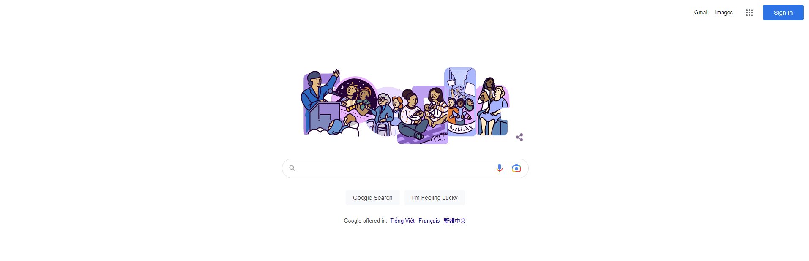
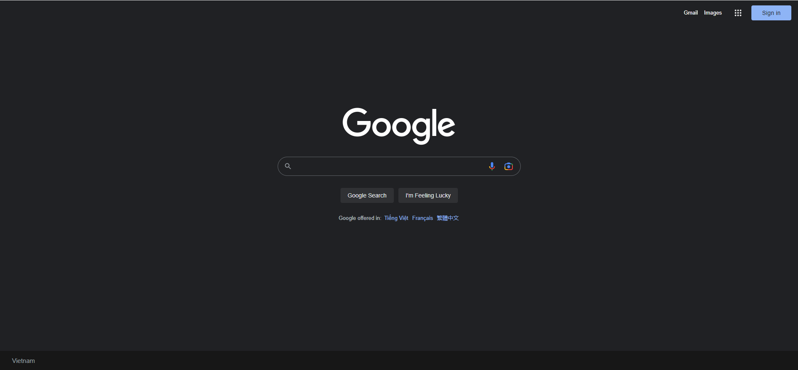
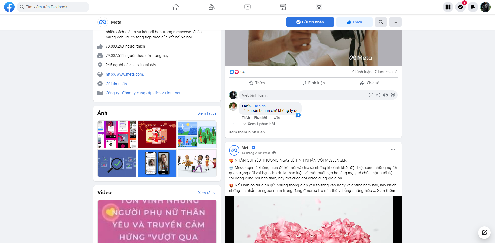
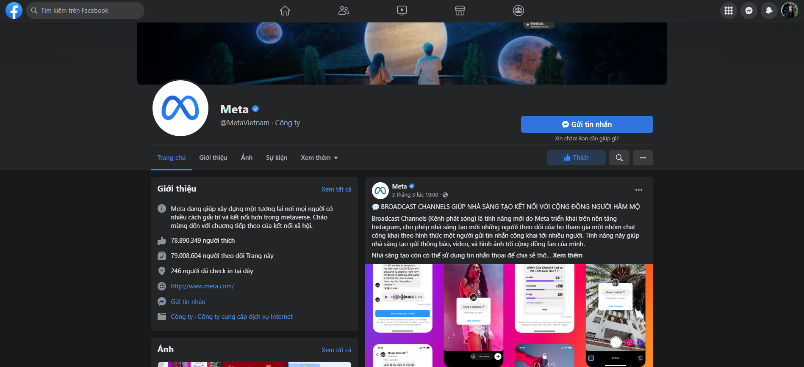
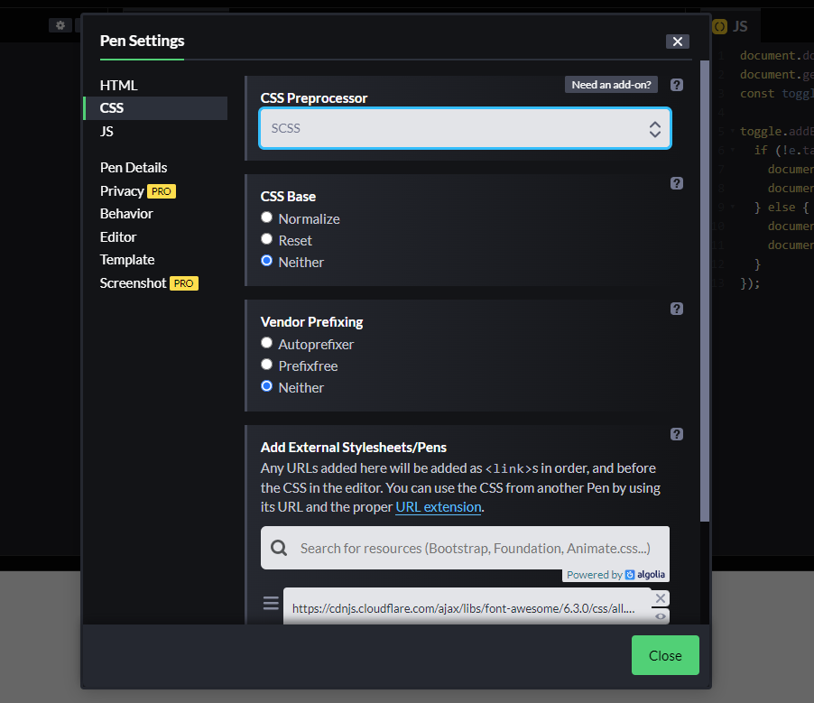
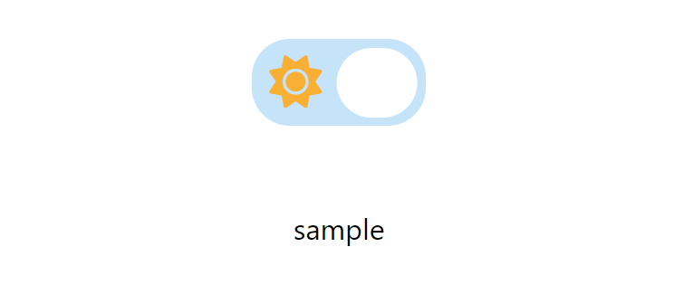
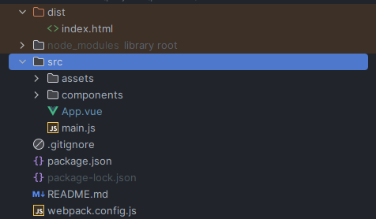
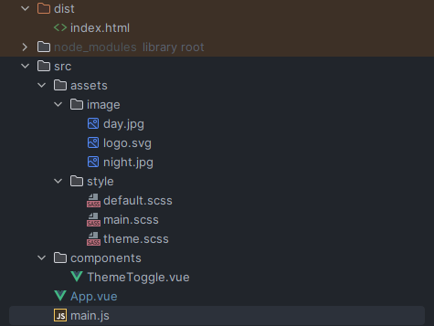

# Ví dụ về Dark mode trong lập trình ứng dụng web

## Lời mở đầu {#introduce}

Chuyển đổi Dark Mode (chế độ tối) là một tính năng hữu ích, xuất hiện hầu hết trên các website ngày nay, ví dụ như:

- Google



- Google (Dark mode)



- Facebook



- Facebook (Dark mode)



Dark Mode luôn là một trong tính năng ưu thích của mình khi sử dụng web cũng như trong phát triển web app. Bản thân mình luôn chú ý tới nó mỗi khi truy cập bất kì website nào.
Một phần vì mình không muốn khi lướt web trong phòng tối lại gặp phải tình huống dưới đây😅: 

<p align="center">
  
</p>

Khá là khó chịu cho mắt phải không 😬 Chắc hẳn chúng ta đều sẽ gặp phải tình huống website có theme (chủ đề) quá sáng dù ít hay nhiều.
Vì vậy, mình sẽ đưa ra một ví dụ đơn giản cho chức năng chuyển đổi Dark Mode trong lập trình ứng dụng web, giúp cải thiện trải nghiệm cho người dùng.

## Dark Mode với HTML, CSS, JS {#darkmode-with-html-css-js}

Trong phần này, mình sẽ đưa ra cách tạo một button (nút) bật/ tắt chế độ Dark Mode, chỉ với HTML, CSS, JS. Mình cũng sẽ sử dụng thêm công cụ là Codepen.
Codepen hỗ trợ việc khởi tạo cũng như thực thi project với HTML, CSS, JS nhanh gọn và trực quan hơn.
Bạn có thể truy cập vào [đây](https://codepen.io/pen/) để sử dụng, hoàn toàn miễn phí 😄.

Đây sẽ là kết quả của chúng ta trong phần này:

<p align="center">
  
</p>

### Bước 1: Thêm HTML, CSS, FontAwesome
Đầu tiên, chúng ta cài đặt [FontAwesome](https://fontawesome.com/search?o=r&m=free) và chuyển bộ CSS preprocessors của Codepen sang SCSS,
giúp code CSS của chúng ta rõ ràng và rành mạch hơn (đọc thêm về SCSS tại [đây](https://sass-lang.com/documentation/style-rules)):



Bắt đầu với HTML, chúng ta sẽ cần tạo 2 phần, nút bật/ tắt Dark Mode và dòng chữ hiển thị:

```html
<div class="toggle-wrapper">
  <input id="toggle" type="checkbox" checked />
  <label class="label" for="toggle">
    <span class="toggle-btn"></span>
    <i class="fa-solid fa-sun label-icon sun"></i>
    <i class="fa-solid fa-moon label-icon moon"></i>
  </label>
</div>
<div id="content">Sample</div>
```
Ở đây mình tạo một checkbox bằng thẻ `<input>` với `checked`. Tiếp đến, ta cần thẻ `<label>` biểu diễn nội dung của checkbox này.
Cuối cùng, một thẻ `<div>` với id là `content` sẽ hiển thị dòng chữ ta muốn.

Với CSS, chúng ta sẽ bổ sung code như dưới đây:

```css
:root {
  --text-color: #000;
  --background-color: #fff;
  --toggle-bg-color: #000;
}

body {
  font-family: system-ui;
  background: var(--background-color);
  color: var(--text-color);
  transition: 0.3s linear;
  height: 100vh;
  margin: 0;
  display: grid;
  place-items: center;
}

#content {
  font-size: 2rem;
}

```
Ta khai báo và gán mã màu cho các biến `--background-color`, `--toggle-bg-color` và `--text-color` thuộc phần tử `root`, ở đây chính là thành phần `<html>`.
Trong phần sau, chúng ta sẽ thay đổi giá trị các biến này, tuỳ vào từng theme cụ thể.
Hiện tại, nội dung của chúng ta chỉ đơn giản như sau:


### Bước 2: Style cho checkbox

Thẻ `<span>` với class `toggle-btn` chính là hiển thị "nút" bật/tắt.
Chúng ta sẽ thêm code CSS nhằm style cho thẻ này và các icon vừa thêm như dưới đây:

```css
.label {
  width: 4rem;
  height: 2rem;
  background-color: var(--toggle-bg-color);
  border-radius: 14px;
  display: flex;
  position: relative;
  cursor: pointer;
  align-items: center;

  .toggle-btn {
    position: absolute;
    background-color: #fff;
    height: 1.6rem;
    width: 1.85rem;
    border-radius: 14px;
    left: 0.25rem;
    transition: linear 0.2s;
  }

  .label-icon {
    width: 2rem;
    text-align: center;
    font-size: 1.2rem;
  }
}

.sun {
  color: #fcb021;
}

.moon {
  color: #f2f4f5;
}
```


Tiếp đến, chúng ta thêm style nhằm "giấu" checkbox.

```css
.toggle-wrapper {
  position: relative;
  zoom: 3;
}

input#toggle {
  opacity: 0;
  position: absolute;
}
```

Cuối cùng, ta thêm đoạn code CSS như ảnh dưới để định nghĩa hai theme ta muốn chuyển đổi thông qua thuộc tính `data-theme`, ở đây là `dark` và `light`.

Các biến CSS mà ta đã khai báo từ trước đó sẽ được gán các mã màu tương ứng với từng theme cụ thể.
Với theme `light`, chúng ta thêm ``transform: translateX(1.7rem);`` cho class `toggle-btn`, nhằm tạo chuyển động tịnh tiến cho "nút" bật/ tắt mỗi khi `data-theme` thay đổi:

```css
[data-theme="dark"] {
  --text-color: #fff;
  --background-color: #272a34;
  --toggle-bg-color: #373838;
}

[data-theme="light"] {
  --text-color: #000;
  --background-color: #fff;
  --toggle-bg-color: #c3e4fa;

  .toggle-btn {
    transform: translateX(1.7rem);
  }
}
```

### Bước 3: Xử lý sự kiện với JS

Ta bổ sung thêm dòng code JS dưới đây, đặt `data-theme` mặc định cho thành phần `<html>` là `light`:

```js
document.documentElement.setAttribute("data-theme", "light");
```

Đây là kết quả của chúng ta:



Nhưng chúng ta chưa thực sự chuyển đổi được sang Dark Mode. Để làm được điều đó,
ta cần thêm đoạn code JS phần xử lý cho sự kiện `change` cho checkbox:

```js
document.getElementById("content").innerHTML = "☀️ Day";
const toggle = document.getElementById("toggle");

toggle.addEventListener("change", (e) => {
  if (!e.target.checked) {
    document.documentElement.setAttribute("data-theme", "dark");
    document.getElementById("content").innerHTML = "Night 🌑";
  } else {
    document.documentElement.setAttribute("data-theme", "light");
    document.getElementById("content").innerHTML = "☀️ Day";
  }
});
```

Trong phần xử lý sự kiện `change`, `data-theme` là `light` khi checkbox `checked`, ngược lại, `data-theme` là `dark` khi ta bỏ `checked`.

Bạn có thể tuỳ chỉnh nội dung trong phần tử có id `content` tuỳ ý với từng `data-theme`.

Kết quả cuối cùng của chúng ta:

<p align="center">
  
</p>

Mọi người có thể vào [đây](https://codepen.io/vietcuongk99/pen/qBMroBd) để xem sample code của mình.


## Dark Mode với Vue.js {#darkmode-with-vuejs}

Trong phần này, mình sẽ triển khai Dark Mode cho một project sử dụng JavaScript framework.
Framework mà mình lựa chọn là **Vue.js**, vì mình đang sử dụng framework này trong hầu hết các project hiện tại (đọc thêm về Vue.js tại [đây](https://vuejs.org/guide/introduction.html)).

Đây là [kết quả](https://vue3-simple-darkmode.vercel.app/) chúng ta có được sau phần này:

<p align="center">
  
</p>

### Bước 1: Khởi tạo project

Đầu tiên, chúng ta cần khởi tạo project Vue. Bạn có thể thực hiện theo hướng dẫn trên trang chủ của Vue tại [đây](https://vuejs.org/guide/quick-start.html#using-vue-from-cdn),
hoặc bạn có thể tham khảo [source code](https://github.com/vietcuongk99/vue3-from-scratch) project Vue 3 mà mình sẽ sử dụng trong phần này.

Chúng ta sẽ cài đặt thêm [FontAwesome](https://fontawesome.com/) cho Vue 3 để sử dụng hai icon ☀️ và 🌑 giống như trong phần trước. Chi tiết hướng dẫn cài đặt bạn có thể xem tại [đây](https://fontawesome.com/docs/web/use-with/vue/#free-icon-packages).

Sau khi cài đặt xong, chúng ta sẽ có kết quả như sau:

- `./main.js`
```js
import { library } from '@fortawesome/fontawesome-svg-core'
/* import font awesome icon component */
import { FontAwesomeIcon } from '@fortawesome/vue-fontawesome'
import {faSun, faMoon} from "@fortawesome/free-solid-svg-icons";
library.add(faSun, faMoon)

import { createApp } from 'vue';
import App from './App.vue'

createApp(App)
  .component('font-awesome-icon', FontAwesomeIcon)
  .mount('#app')

```

### Bước 2: Thêm file mới

Chúng ta sẽ tạo thêm các thư mục như bên dưới:

- `assets/image`: chứa hình ảnh.
- `assets/style`: chứa file style đuôi css, scss,...
- `components`: chứa các component Vue.



Trong thư mục `./assets/image`, chúng ta sẽ thêm logo Vue.js và hai background ứng với từng chủ đề `dark` và `light`,
tải xuống tại [đây](https://github.com/vietcuongk99/vue3-simple-darkmode/tree/main/src/assets/image).

Trong thư mục `./assets/style`, chúng ta sẽ thêm các file `.scss` như sau:

- `default.scss`: style mặc định cho project:

```css
:root {
  --text-color: #000;
  --background-color: #fff;
  --toggle-bg-color: #000;
}

body {
  font-family: Roboto, Arial, sans-serif;
  background: var(--background-color);
  color: var(--text-color);
  transition: 0.3s linear;
  height: 100vh;
  margin: 0;
}
```

- `theme.scss`: định nghĩa theme cho project

```css
[data-theme="dark"] {
  --text-color: #fff;
  --background-color: #272a34;
  --toggle-bg-color: #373838;
}

[data-theme="light"] {
  --text-color: #000;
  --background-color: #fff;
  --toggle-bg-color: #c3e4fa;
}
```

- `main.scss`: import các file style cần cho project

```css
@import 'default.scss';
@import 'theme.scss';
```

Và đừng quên, chúng ta cần thêm dòng `import` file `./main.scss` như sau:

- `./main.js`

```js
import './assets/style/main.scss'
```


Trong thư mục `./components`, mình thêm component `ThemeToggle`, làm nút bật/ tắt Dark Mode.
Bạn có thể dùng bất kì tên nào phù hợp hơn.

```js
<template>
  <div class="toggle-wrapper">
    <input id="toggle" type="checkbox" checked @change="change" />
    <label class="label" for="toggle">
      <span class="toggle-btn"></span>
      <font-awesome-icon icon="fa-solid fa-sun" class="label-icon sun" />
      <font-awesome-icon icon="fa-solid fa-moon" class="label-icon moon" />
    </label>
  </div>
</template>

<script>

export default {
  name: "ThemeToggle",
  props: {
    primaryTheme: String,
    secondaryTheme: String,
  },

  setup (props) {
    const change = (event) => {
      if (!event.target.checked) document.documentElement.setAttribute("data-theme", props.secondaryTheme);
      if (event.target.checked) document.documentElement.setAttribute("data-theme", props.primaryTheme);
    }

    return {
      change,
    }
  }
}
</script>

<style lang="scss" scoped>

.toggle-wrapper {
  position: relative;
  zoom: 1.5;
  top: 0;
  right: 0;
}

input#toggle {
  opacity: 0;
  position: absolute;
}

.label {
  width: 4rem;
  height: 2rem;
  background-color: var(--toggle-bg-color);
  border-radius: 14px;
  display: flex;
  position: relative;
  cursor: pointer;
  align-items: center;

  .toggle-btn {
    position: absolute;
    background-color: #fff;
    height: 1.6rem;
    width: 1.85rem;
    border-radius: 14px;
    left: 0.25rem;
    transition: linear 0.2s;
  }

  .label-icon {
    width: 2rem;
    text-align: center;
    font-size: 1.2rem;
  }
}

.sun {
  color: #fcb021;
}

.moon {
  color: #f2f4f5;
}

[data-theme="light"] {
  .toggle-btn {
    transform: translateX(1.7rem);
  }
}

</style>

```

Về cơ bản, các logic code ứng với từng phần đều tương tự như ở phần [trước](#darkmode-with-html-css-js):
- Trong phần `<template>`, chúng ta sử dụng component `<font-awesome-icon>` thay cho thẻ `<i>` để hiển thị icon.
- Trong phần `<script>`,  hai `prop` là `primaryTheme` và `secondaryTheme`, gán cho thuộc tính `data-theme` của phần tử `html` ứng với hai trường hợp `checked` của checkbox.

### Bước 3: Cập nhật App.vue

Ở file `./App.vue`, chúng ta sẽ cập nhật lại như dưới đây:

```js
<template>
  <div class="theme-toggle-wrapper">
    
    <ThemeToggle :primary-theme="primaryTheme" :secondary-theme="secondaryTheme"/>
  </div>
  <div class="background"></div>
</template>

<script>
import { ref } from 'vue'
import ThemeToggle from "./components/ThemeToggle.vue";
export default {
  components: {ThemeToggle},
  setup () {
    const primaryTheme = ref('light')
    const secondaryTheme = ref('dark')
    return {
      primaryTheme,
      secondaryTheme,
    }
  },

  mounted() {
    document.documentElement.setAttribute("data-theme", this.primaryTheme);
  }
}
</script>

<style lang="scss">
.theme-toggle-wrapper {
  position: absolute;
  top: 0;
  display: flex;
  justify-content: space-between;
  padding: 1rem;
  width: calc(100% - 2rem);
}
.background {
  width: 100vw;
  height: 100vh;
  transition: all 0.5s ease;
}

[data-theme="dark"] {
  .background {
    background-image: url("assets/image/night.jpg");
  }
}

[data-theme="light"] {
  .background {
    background-image: url("assets/image/day.jpg");
  }
}

</style>

```

<p align="center">
  
</p>

Qua hình trên, chúng ta bổ sung logo Vue, component `ThemeToggle` làm nút bật/ tắt Dark Mode và style chuyển đổi thuộc tính `background-image` với từng `data-theme`.
Ở hook `mounted`, chúng ta sẽ gán `primaryTheme` cho `data-theme` mặc định, ở đây mình chọn `primaryTheme` là `light`.

Vậy là xong 😊. Cấu trúc project của chúng ta sẽ như dưới đây. Mở cmd và gõ dòng lệnh `npm run dev` để chạy project của bạn.



Bạn có thể tham khảo source code của mình tại [đây](https://github.com/vietcuongk99/vue3-simple-darkmode).


## Tổng kết {#summary}

Thông qua bài viết này, mình đã đưa ra một ví dụ và cách triển khai Dark Mode trong lập trình web app.
Hi vọng các bạn có thêm cách tham khảo để triển khai tính năng hữu ích này, giúp trải nghiệm người dùng trên website của chúng ta được tốt hơn.

Bên cạnh đó, việc chuyển đổi Dark Mode đã được các thư viện UI hỗ trợ rất linh hoạt, ví dụ như [Ant Design](https://ant.design/docs/react/customize-theme), [MUI](https://mui.com/material-ui/customization/theming/), [Vuetify](https://vuetifyjs.com/en/features/theme/),...
Trong các bài viết sắp tới, mình sẽ đưa ra ví dụ cho việc áp dụng chúng vào trong project về web app. 

Peace.

